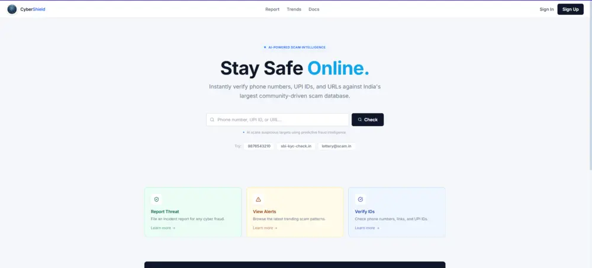

# Bhargab Deka — Full Stack Developer Portfolio



A premium, high-performance developer portfolio built to showcase production-grade applications, real-time engines, and AI-integrated systems. The platform features a sophisticated dark/light mode design system, smooth GSAP animations, and enterprise-level performance optimizations.

**Live Website:** [https://bhargab-deka-portfolio.vercel.app](https://bhargab-deka-portfolio.vercel.app)

---

## 🚀 Key Features & Performance

- **Dynamic Theme System:** Seamless light/dark mode toggling with persistent user preference storage.
- **Premium Aesthetics:** Glassmorphism UI components, subtle ambient glows, and modern typography (`Plus Jakarta Sans` & `Outfit`).
- **Smooth Animations:** Integrated `GSAP` for performant, hardware-accelerated scroll animations and page transitions.
- **Extreme Performance:** 
  - Sub-5-second production builds using `Vite`.
  - Intelligent route and component code-splitting via `React.lazy` and `Suspense`.
  - Optimized font pre-connecting to eliminate Flash of Unstyled Text (FOUT).
  - Lazy-loaded media assets to minimize initial 3G/4G bandwidth consumption.
- **Fully Responsive:** Fluid scaling typography and CSS grid systems designed for flawless mobile-first viewing.

---

## 🛠️ Tech Stack Architecture

- **Core:** React 18, TypeScript, Vite
- **Styling:** Vanilla CSS3 with Custom Properties (CSS Variables) & Modular Scoping
- **Animations:** GSAP (GreenSock Animation Platform)
- **Icons:** React Icons (`react-icons`)
- **Deployment:** Vercel

---

## 💻 Featured Projects Showcased

1. **TextileHub — B2B Textile Marketplace:** A full-stack MERN application with role-based buyer/supplier portals, bulk ordering, and an interactive AI sourcing assistant.
2. **CyberShield:** Real-time AI complaint analysis portal featuring dynamic risk scoring, MongoDB analytics, and JWT security.
3. **InterviewOS:** A robust real-time platform built with Next.js, Go, WebRTC, and PostgreSQL.
4. **ORION Hostel Portal:** Complete administrative dashboard for hostel management and grievance redressal.

---

## ⚡ Local Development & Installation

To run this portfolio locally on your machine:

1. **Clone the repository:**
   ```bash
   git clone https://github.com/bhargabdeka-deka/bhargab-portfolio.git
   ```

2. **Navigate to the directory:**
   ```bash
   cd bhargab-portfolio
   ```

3. **Install dependencies:**
   ```bash
   npm install
   ```

4. **Start the local development server:**
   ```bash
   npm run dev
   ```

5. **Open your browser:**
   Navigate to `http://localhost:5173` (or the port specified in your terminal).

---

## 👨‍💻 About Me

I am a Full Stack Software Engineer and final-year Computer Science student at **Jorhat Engineering College** (Assam, India). I specialize in the MERN stack, system-level optimizations, and integrating AI-driven solutions into scalable web architectures.

- **Email:** [bhargab1234deka@gmail.com](mailto:bhargab1234deka@gmail.com)
- **LinkedIn:** [bhargab-deka-417126200](https://www.linkedin.com/in/bhargab-deka-417126200)
- **GitHub:** [@bhargabdeka-deka](https://github.com/bhargabdeka-deka)

---

*Designed and developed by Bhargab Deka. Copyright © 2026.*
